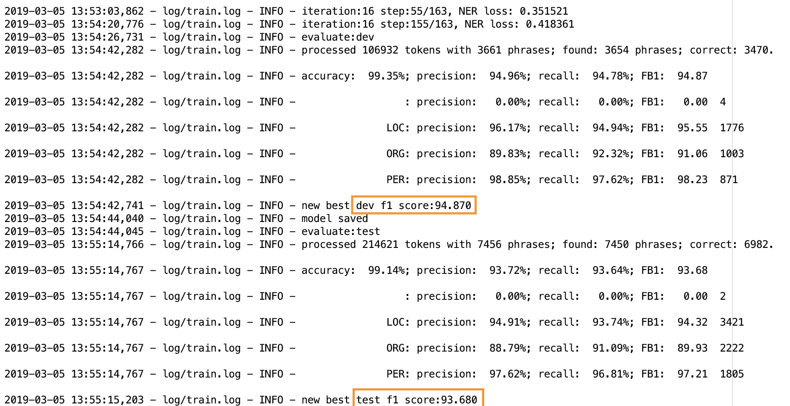

# *XLNet-ChineseNER*

### *Introduction*

该项目是基于谷歌开源的BERT预训练模型，在中文NER任务上进行fine-tune。

### *Datasets & Model*

训练本模型的主要标记数据，来自于zjy-usas的[ChineseNER](https://github.com/zjy-ucas/ChineseNER)项目。本项目在原本的BiLSTM+CRF的框架前，添加了BERT模型作为embedding的特征获取层，预训练的中文BERT模型及代码来自于Google Research的[bert](https://github.com/google-research/bert)。

### *Results*

引入bert之后，可以看到在验证集上的F-1值在训练了16个epoch时就已经达到了**94.87**，并在测试集上达到了**93.68**，在这个数据集上的F-1值提升了两个多百分点。

### *Train*

1. 下载[XLNet的中文预训练模型]，解压放入本项目根目录
2. 搭建依赖环境python3+tensorflow1.12
3. 执行`python3 train.py`即可训练模型
4. 执行`python3 predict.py`可以对单句进行测试
